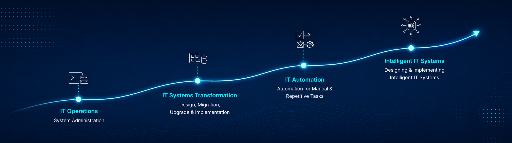

  

  
  

## Hey, I'm Animesh 👋

**Senior Infrastructure Automation Engineer, building toward Agentic AI Infrastructure.**

I've spent 12 years on a deliberate path: **Systems & Infrastructure Administration → Planning, Design, Migration & Implementation → Enterprise Automation Solutions.** Along the way I've worked hands-on with VMware, Citrix, Windows Server, PowerShell, vRealize Automation/Orchestrator, and Digitate ignio — designing and implementing infrastructure-based automation for real enterprise use cases, not just scripting one-off tasks.

I'm now extending that same instinct into **agentic AI** — building infrastructure that doesn't just execute predefined steps, but can reason about system state and act on it safely. That means going deep on AWS, Claude's agent architecture, and the Model Context Protocol (MCP), and applying it to the same kind of infrastructure problems I've spent a career solving.

🎯 **Currently focused on:** Cloud infrastructure (AWS), agentic AI architecture, MCP-based tool design, and AIOps.

---

## 🔨 What I'm Building

*This section grows as projects ship — no placeholders pretending to be finished work.*

| Project | Description | Status |
|---|---|---|
| 🤖 **Agentic Infra Assistant** *(name pending)* | 🔲 In progress | 🔲 In progress |

*(Repo link goes here once live — see the note in the plan file about not linking an empty/placeholder repo.)*

---

## ✍️ Writing & Publishing

*Just getting started here — this section grows as posts actually go live, not before.*

| Piece | Platform | Status |
|---|---|---|
| *Topic TBD * | LinkedIn Articles / Medium.com | 🔲 Planned |

---

## 🏅 Certifications

| Category | Certifications |
|---|---|
| **Cloud Architecture** | Google Professional Cloud Architect |
| **Infrastructure as Code** | HashiCorp Certified: Terraform Associate (003) |
| **DevOps / CI-CD** | GitHub Actions , GitHub Copilot |
| **AI / Agentic AI** | Microsoft Certified: Azure AI Apps and Agents Developer Associate, Microsoft certified: Agentic AI Business Solutions Architect, Build with Vertex — Technical Expert Badge |
| **Automation** | Microsoft Certified: Power Automate RPA Developer Associate |
| **In progress** | Claude Certified Architect |

---

## 🧰 Core Toolset

`PowerShell` `Python` `VMware vSphere` `vRealize Orchestrator` `Digitate ignio` `Control-M` `Microsoft Power Automate` `Terraform` `GitHub Actions` `AWS` `Google Cloud` `Claude API` `MCP`

---

## 📊 GitHub Stats

  
  

---

## 🤝 Let's Connect

  
  

